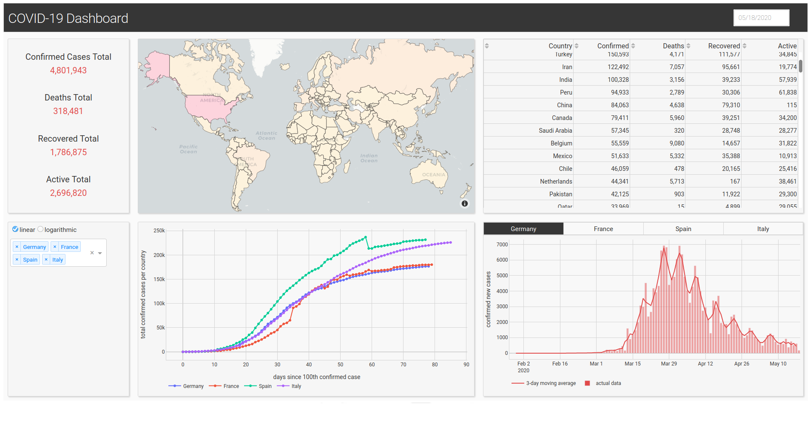

# COVID-19 Dashboard
**Disclaimer:
This dashboard and data visualization is in no way to be used for sophisticated decision making regarding the
current events of the pandemic. This is a personal project with the main focus of gaining knowledge on the 
utilization of the Python Dash library.**


This project provides a dashboard for the visualization of infection data of the ongoing COVID-19 
pandemic. Building upon the "COVID-19 Data Repository by the Center for Systems Science and Engineering (CSSE) at Johns Hopkins University" (1) and vector data by
Natural Earth (2), the dashboard itself is created by using the Python framework Dash (3). It provides information about the current worldwide development of 
the disease and shows both daily charts, as well as charts covering the time frame from disease outbreak up to the current day. 

## Installation & Requirements
The following instructions assume that the your current working directory is a local copy of the repository.
At the moment, there are two ways to run the dashboard on your own machine:
#### Anaconda
Create a new Anaconda environment called *covid-dashboard* by using the provided *environment.yml*
(the environment name is changeable by editing the first line in the yaml file):
```
conda env create -f environment.yml
```
You can then activate the enviroment and start up the dashboard running `python3 app.py` 

#### Docker
Build your own docker image using the provided Dockerfile via
```
docker build . --rm -t covid-dashboard
```
to create an image called *covid-dashboard*. When running the container, it is 
advised to mount a volume where the downloaded and parsed data is stored. This 
can be a local folder (don't forget to change the host path in the `docker run [...]` 
command if do so) or a docker volume for example. If you want to use the latter,
you can create a volume named *dashboard-volume* using:
```
docker volume create dashboard-volume
```
After the build process has successfully completed, you can run the image in a
container via
```
docker run \
  -ti \
  --name covid-dashboard \
  --publish 8050:8050 \
  --volume dashboard-volume:/home/appuser/app/data \
covid-dashboard
```
You can also use `docker_build.sh` and `docker_run.sh` which contain the commands
specified above.

## Usage
The dashboard is web based and can be accessed via browsing to 
`http://0.0.0.0:8050/` with a browser of your choice (On Linux / Docker). If you are running the dashboard on a Windows machine you need to 
use `http://127.0.0.1:8050/` or `http://localhost:8050/`.

## Resources
1. ["COVID-19 Data Repository 
by the Center for Systems Science and Engineering (CSSE) at Johns Hopkins University"](https://github.com/CSSEGISandData/COVID-19)
2. Made with Natural Earth. Free vector and raster map data @ [naturalearthdata.com](https://www.naturalearthdata.com/downloads/110m-physical-vectors/110m-land/).
